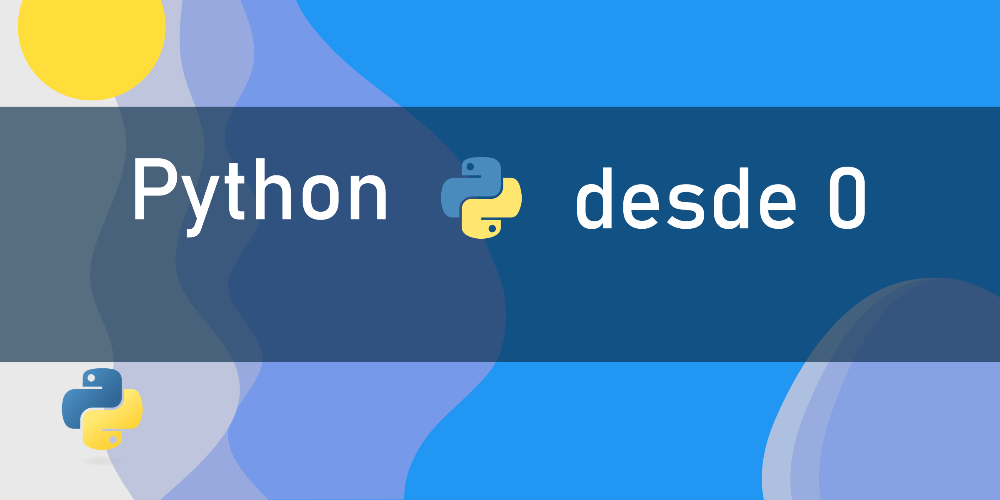

# Python-desde-0

## 🔎 Introducción
**Python-desde-0** es un repositorio diseñado para aprender y reforzar los conceptos básicos de Python, uno de los lenguajes de programación más populares y versátiles. Aquí encontrarás:

- Definiciones claras y concisas de conceptos clave.
- Ejercicios prácticos para aplicar lo aprendido.
- Explicaciones dinámicas que hacen que aprender Python sea divertido y efectivo.

Ya sea que estés comenzando desde cero o buscando reforzar tus conocimientos, este repositorio te guiará en tu aprendizaje.

---

## 🔧 Contenido
El repositorio está organizado por módulos para facilitar el aprendizaje:

1. **Introducción a Python**
   - Qué es Python y para qué se usa.
   - Instalación de Python y configuración del entorno.
   - Tu primer programa en Python: `Hola, Mundo`.

2. **Tipos de datos y variables**
   - Enteros, flotantes, cadenas y booleanos.
   - Declaración de variables y convenciones de nombres.
   - Ejercicios prácticos.

3. **Estructuras de control**
   - Condicionales: `if`, `else`, `elif`.
   - Bucles: `for`, `while`.
   - Prácticas de estructuras de control.

4. **Funciones**
   - Definición y uso de funciones.
   - Parámetros y valores de retorno.
   - Ejercicios resueltos y propuestos.

5. **Listas, tuplas y diccionarios**
   - Estructuras de datos esenciales.
   - Operaciones comunes y buenas prácticas.
   - Ejercicios prácticos para dominar estas estructuras.

6. **Manejo de errores**
   - Excepciones y el uso de `try`, `except`.
   - Ejercicios para identificar y corregir errores.

7. **Módulos y librerías**
   - Uso de módulos incorporados y cómo instalar librerías externas.
   - Ejemplos de librerías populares como `math` y `random`.

---

## 📈 Objetivo
El objetivo de este repositorio es proporcionar un recurso integral y accesible para aprender Python desde cero, con un enfoque en la práctica y la comprensión de los fundamentos.

---

## 🔄 Cómo contribuir
¡Tus aportes son bienvenidos! Si deseas contribuir:

1. Haz un fork del repositorio.
2. Crea una rama con tu función o mejora: `git checkout -b mi-mejora`.
3. Realiza tus cambios y haz un commit: `git commit -m "Descripción de los cambios"`.
4. Envía un pull request.

---

## 🔧 Requisitos
Para aprovechar al máximo este repositorio, necesitas:
- Python 3.7 o superior.
- Un editor de código como Visual Studio Code, PyCharm o cualquier otro de tu preferencia.

---

## 🔓 Recursos adicionales
- [Documentación oficial de Python](https://docs.python.org/3/)
- [Tutorial de Python en W3Schools](https://www.w3schools.com/python/)
- [Curso de Python desde 0](https://www.youtube.com/watch?v=Kp4Mvapo5kc)

---

## 💪 Autores
Este proyecto fue desarrollado con dedicación por:
 - [MahdiDev](https://github.com/mahdi20121980)
 - [Rickmij](https://github.com/Rickmij)
 - [Alejosor](https://github.com/Alejosor)
 - [Javi](https://github.com/xj4v1x)
 
¡Si este repositorio te resulta útil, no dudes en darle una estrella! 🌟

---

¡Gracias por explorar **Python-desde-0**! 📚
